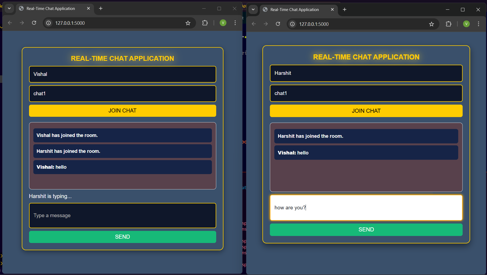
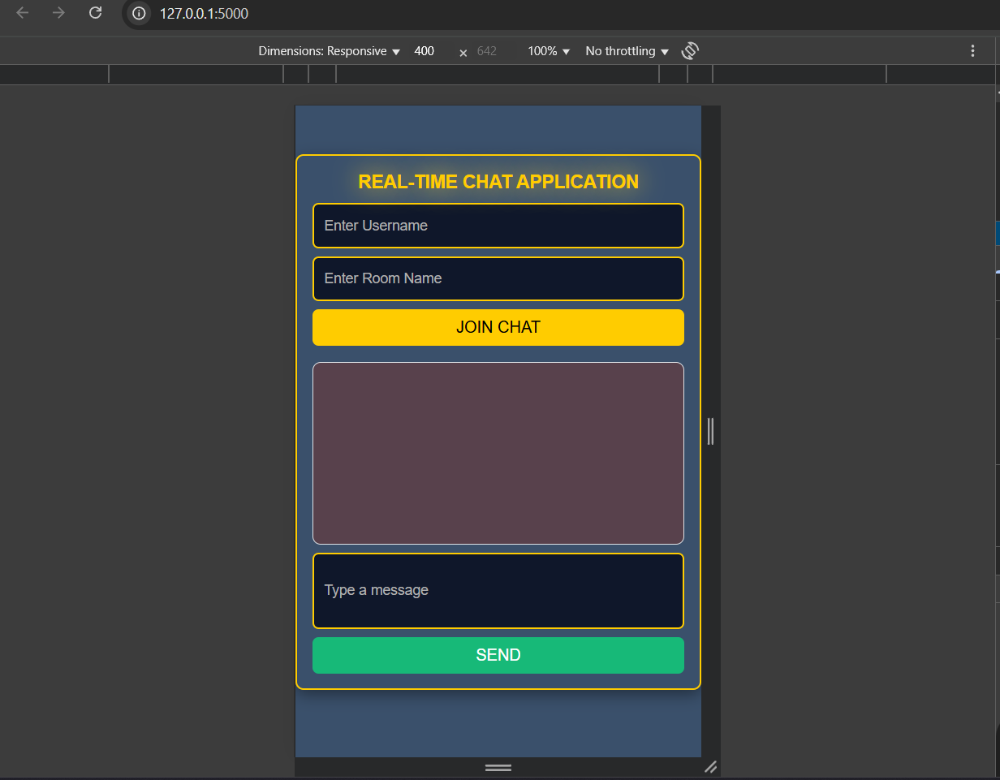

# 💬 Real-Time Flask Chat App

A real-time, room-based chat application built with Flask and Flask-SocketIO that enables multiple users to exchange messages instantly in chat rooms. It features WebSockets for low-latency communication, a responsive design, and a typing indicator for enhanced interactivity.

---

## 🚀 Features

- ✅ Real-time communication using WebSockets (Flask-SocketIO)
- ✅ Room-based chat support (multiple rooms)
- ✅ Typing indicator for active users
- ✅ Responsive UI for mobile and desktop
- ✅ Clean, modern interface with Bootstrap and custom CSS
- ✅ User join/leave notifications
- ✅ Handles multiple concurrent users

---

## 🖼️ Screenshots

| Desktop View | Mobile View |
|--------------|-------------|
|  |  |

---

## 🛠️ Tech Stack

| Technology | Usage |
|------------|-------|
| Python | Backend logic |
| Flask | Web framework |
| Flask-SocketIO | Real-time WebSocket communication |
| HTML/CSS | Frontend structure and design |
| Bootstrap | Responsive UI components |
| JavaScript | Frontend interactivity |

---

